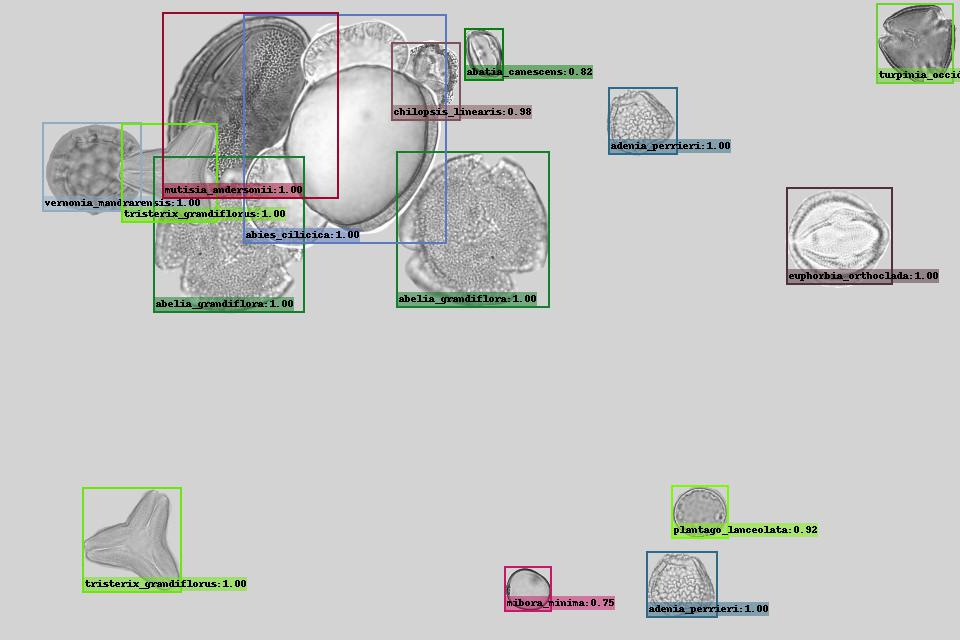
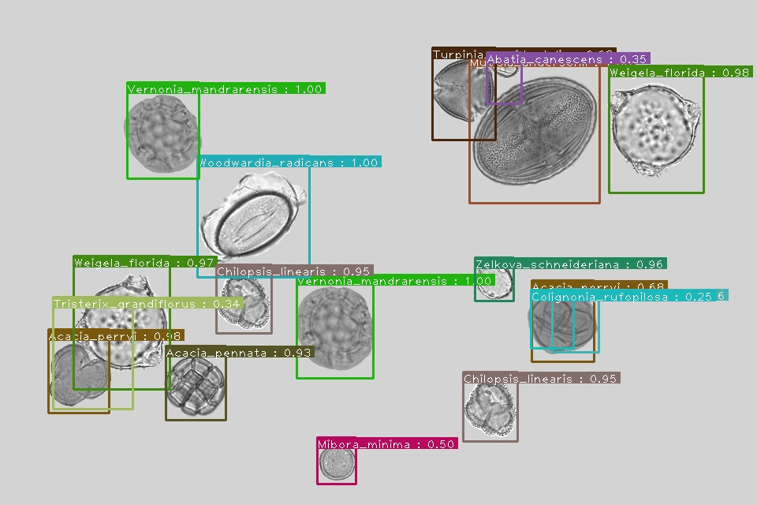

# Beeopicture

Final year project which consists of developing a pollen detection model using object detection algorithms in Deep Learning. The idea behind the project was to solve an issue from Beeodiversity, a social company that uses pollen collected by bees to identify the biodiversity at certain places. The goal was to automate/accelerate the process of pollen analysis in the lab. We essentially worked on the Data Science part of the project. The work was scinded in the three following parts :
 - Scraping of different data sources to build the dataset
 - Training and inference testing in Colab notebooks
 - Web Application to test the inference and view the results

## Dataset

The bots used to scrape datas are in scraping/bots folder. The dataset from INRA and OREME are in the corresponding zip archive. The dataset was then build using the [Recompositron](https://github.com/AzeoGarage/ShareAI-Beeodiversity-SmartBeeHive/tree/master/src/PollenDetector/Tools/Recompositron) software built by AZEO, the project initiator. The datasets were stored on Azure Data Lake.

## Data Science

We have been able to test and compare different object detection algorithms (Faster-RCNN, YOLOv5, SSD and EfficientDet-V2) using Google Colaboratory. We trained at different scales depending on Colab's limits. The different metrics and Colab for training and inference testing are in the notebooks/ folder.

## Inference

Inferences tested at various scales according to the possibilities of Google Colab.

SSD

YOLOv5

EfficientDet

Faster-RCNN
